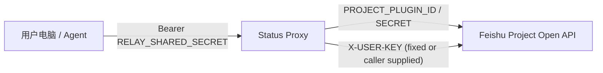

# Feishu Project Status Proxy

For Codex handoff and takeover notes, see [CODEX_HANDOFF.md](./CODEX_HANDOFF.md).

这套目录把原来“每台电脑都要拿 Feishu 插件密钥直连”的方式，升级成了：

`公共 Feishu 插件 + 中间代理服务 + 轻客户端/agent 调用`

核心目标只有两个：

1. Feishu 插件密钥只保存在服务端。
2. 其他人的电脑、脚本、agent 只拿代理地址和代理共享密钥，不再各自配置 `PROJECT_PLUGIN_SECRET`。

## 架构



## 目录

- `server.py`
  代理服务本体，暴露 HTTP 接口。
- `proxy_core.py`
  Feishu 鉴权、工作项匹配、工作流路径查找、状态流转核心逻辑。
- `view_links.py`
  Feishu Project 视图链接解析。
- `client.py`
  给本地电脑或 agent 用的轻客户端。
- `run_server.sh`
  启动脚本，会自动读取同目录 `.env.local`。
- `.env.example`
  服务端环境变量模板。
- `openapi.json`
  代理接口定义，后续如果要再包成插件会很方便。

## 这版已经支持什么

- 统一托管 Feishu Project 插件凭据
- 按任务标题、资产名、工作项 ID 批量预览状态变更
- 批量执行状态变更
- 统一控制是否允许真实执行
- 可选允许调用方传 `project_user_key`，用于按人审计
- 解析 Feishu Project saved view link，识别：
  - `issueView/<view_id>`
  - `storyView/<view_id>`
  - `workObjectView/<type>/<view_id>`

## 这版暂时还没接上的能力

- `saved view link -> 自动拉取该视图下的工作项列表`

原因不是代理架构问题，而是我们当前本地可复用的稳定能力主要来自：

- Feishu Project Open API 的工作项筛选、工作流查询、状态流转
- Codex 里的 Feishu Project MCP 视图读取能力

前者适合做服务端，后者当前更像是 agent 内部连接器，不适合直接搬到独立 HTTP 服务里。所以这版把“视图链接解析”先做成稳定入口，把“视图行数据解析”显式保留为后续扩展点，而不是先塞一个不确定实现。

## 服务端环境变量

复制一份 `.env.example` 为 `.env.local`，至少填：

```bash
RELAY_SHARED_SECRET=replace-with-shared-secret
PROJECT_PLUGIN_ID=...
PROJECT_PLUGIN_SECRET=...
PROJECT_KEY=rzoecp
```

也可以改用其他服务端鉴权模式：

1. `PROJECT_USER_PLUGIN_TOKEN`
   最简单，服务端直接持有用户级 plugin token。
2. `PROJECT_PLUGIN_TOKEN + PROJECT_USER_KEY`
   服务端固定一组 plugin token + user key。
3. `PROJECT_PLUGIN_ID + PROJECT_PLUGIN_SECRET + PROJECT_USER_KEY`
   推荐，服务端自己换取 plugin token。

### 关键开关

- `ALLOW_EXECUTE=1`
  允许真实执行。设成 `0` 就变成纯预览环境。
- `ALLOW_CALLER_USER_KEY=1`
  允许调用方通过 body 或 `X-Project-User-Key` 指定操作者身份。
- `REQUIRE_CALLER_USER_KEY=1`
  强制每次请求都显式传 `project_user_key`，不再回落到服务端默认身份。
- `AUDIT_LOG_PATH=logs/audit.jsonl`
  记录 `preview / execute / error` 的 JSONL 审计日志，便于回查是谁批量改了状态。

如果你更看重审计，建议直接使用：

1. `ALLOW_CALLER_USER_KEY=1`
2. `REQUIRE_CALLER_USER_KEY=1`
3. `PROJECT_USER_KEY=` 留空
4. 开启 `AUDIT_LOG_PATH`

## 启动

```bash
cd /Users/jiangwen/Desktop/feishu-project-status-proxy
bash run_server.sh
```

默认监听：

- `http://127.0.0.1:8787`

## 健康检查

```bash
python3 client.py health
```

或者：

```bash
curl http://127.0.0.1:8787/health
```

## 轻客户端用法

先给客户端准备两个环境变量：

```bash
export FEISHU_STATUS_PROXY_BASE_URL=http://127.0.0.1:8787
export FEISHU_STATUS_PROXY_SHARED_SECRET=replace-with-shared-secret
export FEISHU_PROJECT_USER_KEY=<your-feishu-user-key>
```

### 1. 预览

```bash
python3 client.py preview \
  --target 修改中 \
  --work-item-type 69ca097070c61cbef714a50f \
  --name 大石堆的图标 \
  --name 7521306981198391468
```

### 2. 执行

```bash
python3 client.py execute \
  --target 验收中 \
  --work-item-type 69ca097070c61cbef714a50f \
  --names-file /tmp/asset_subtasks.txt
```

### 3. 解析 saved view link

```bash
python3 client.py parse-view-link \
  "https://project.feishu.cn/rzoecp/workObjectView/asset_subtask/xhfSshxvg?scope=workspaces&node=29455352"
```

## HTTP 接口

### `GET /health`

返回服务状态和公开配置，不暴露 secret。

### `POST /parse-view-link`

请求：

```json
{
  "view_link": "https://project.feishu.cn/rzoecp/issueView/60rm59Svg?scope=workspaces&node=28172937"
}
```

### `POST /preview-status`

请求：

```json
{
  "target": "修改中",
  "work_item_type": "69ca097070c61cbef714a50f",
  "queries": [
    "大石堆的图标",
    "7521306981198391468"
  ]
}
```

### `POST /execute-status`

请求：

```json
{
  "target": "验收中",
  "work_item_type": "69ca097070c61cbef714a50f",
  "queries": [
    "大石堆的图标"
  ],
  "confirm_execute": true
}
```

### `POST /resolve-view-items`

这版会返回 `501`，表示接口合同已经预留，但还没接入 saved view 实际解析。

## 给其他 agent 的接入方式

别的 agent 不再需要：

- `PROJECT_PLUGIN_SECRET`
- `PROJECT_PLUGIN_ID`
- `PROJECT_USER_KEY`

它们只需要：

```bash
export FEISHU_STATUS_PROXY_BASE_URL=http://your-proxy-host:8787
export FEISHU_STATUS_PROXY_SHARED_SECRET=replace-with-shared-secret
export FEISHU_PROJECT_USER_KEY=<their-own-feishu-user-key>
```

然后调用：

```bash
python3 client.py preview --target 修改中 --names-file /tmp/tasks.txt
```

或者直接发 HTTP 请求到代理服务。

## 推荐上线方式

### 最小可用

1. 一台内部机器或云函数跑 `server.py`
2. 服务端只保存 Feishu 插件密钥
3. 客户端只保存代理共享密钥

### 更稳的正式版

1. 代理服务部署到固定域名
2. `RELAY_SHARED_SECRET` 换成更细粒度的调用凭据
3. 服务端增加调用审计日志
4. 服务端增加 `caller -> allowed user_key` 映射
5. 后续补上 `saved view -> item list` 专用解析器

## Git 仓库建议

如果你的目标是“别的 Codex 以后也能稳定接手”，建议把这个目录直接作为一个独立 Git 仓库维护。

最小要求：

1. 提交代码、脚本、`README.md`、`openapi.json`、`.env.example`
2. 不提交任何真实 secret，只提交环境变量模板
3. 让仓库首页的 README 就能说明：怎么配环境、怎么启动、怎么预览、怎么执行

这份目录现在已经补了 `.gitignore`，默认会忽略：

- `.env.local`
- 其他本地 `.env` 文件
- `__pycache__`
- Python 编译产物

推荐仓库名可以直接用：

- `feishu-project-status-proxy`

推荐交接方式：

1. 维护者把仓库推到 GitHub 或内部 Git 平台
2. 部署人只在目标机器上创建 `.env.local`
3. 其他 Codex 或开发者通过仓库拉代码，再按 README 部署

## 为什么这套比“每人各配一个插件”更合适

- Feishu 插件密钥不再分发到每台电脑
- 旋转密钥只改服务端
- 可以统一限制执行权限
- 可以逐步补审计、限流、allowlist
- agent 的调用方式更稳定，迁移成本更低

## 下一步最值得补的两项

1. `saved view` 解析器
   让 `workObjectView/...` 直接变成工作项列表。
2. 调用身份治理
   把“谁能以谁的 user_key 执行”做成服务端规则。
